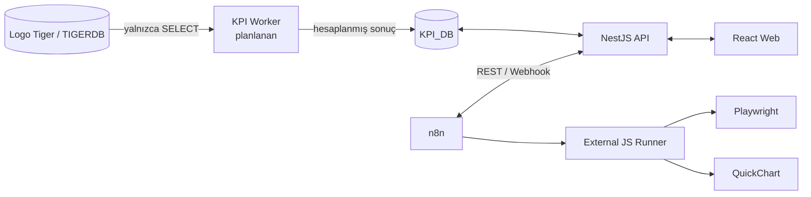

# Retail KPI Platform

Logo Tiger ERP kullanan perakende ve tekstil işletmeleri için bağımsız, mobil öncelikli KPI yönetim platformu.

Platform; uygulama kullanıcılarını ve cihaz oturumlarını yönetir, Logo Tiger verilerini salt okunur olarak kullanır ve hesaplanmış KPI sonuçlarını uygulamaya ait `KPI_DB` veritabanında saklamak üzere tasarlanmıştır. n8n otomasyonları, harici JavaScript task runner, Playwright ve QuickChart aynı Docker Compose ağı içinde hazırdır.

> [!IMPORTANT]
> Repository temeli, kimlik doğrulama, çalışan yönetimi, dosya sistemi ve Docker çalışma ortamı hazırdır. KPI hesaplama motoru henüz uygulanmamıştır.

## Mimari



- `TIGERDB`, Logo Tiger kaynak veritabanıdır ve uygulama açısından kesinlikle salt okunurdur.
- `KPI_DB`, kullanıcıları, cihaz oturumlarını, dosya metadata'sını ve ileride KPI sonuçlarını saklar.
- SQL Server, Docker Compose tarafından kurulmaz veya başlatılmaz.
- Mevcut cross-database view yapısı nedeniyle `KPI_DB` ve `TIGERDB` aynı SQL Server instance'ında bulunmalıdır.
- Migration yalnızca `KPI_DB` üzerinde, açık bir komutla çalıştırılır.

## Teknoloji yığını

| Katman                | Teknoloji                             |
| --------------------- | ------------------------------------- |
| Backend               | NestJS, TypeScript, REST, TypeORM     |
| Frontend              | React, TypeScript, Vite, Tailwind CSS |
| İstemci veri yönetimi | TanStack Query, Zustand               |
| Veritabanı            | Harici Microsoft SQL Server 2017+     |
| ERP kaynağı           | Logo Tiger / TIGERDB                  |
| Otomasyon             | n8n `2.35.7`                          |
| Tarayıcı otomasyonu   | Playwright `1.62.0`                   |
| Grafik üretimi        | QuickChart `1.8.1`                    |
| Çalışma ortamı        | pnpm workspace, Docker Compose        |

## Hazır özellikler

- Access ve refresh token tabanlı kimlik doğrulama
- Refresh token rotation ve cihaz bazlı oturum yönetimi
- Mevcut cihazdan veya bütün cihazlardan çıkış
- `full_access` yetkisiyle çalışan yönetimi
- Logo Tiger satış personeliyle opsiyonel çalışan eşlemesi
- JPEG, PNG ve WEBP avatar yükleme; WEBP dönüşümü ve boyut varyantları
- Sahipsiz dosyalar için zamanlanmış temizlik
- Swagger / OpenAPI dokümantasyonu
- n8n external JavaScript task runner
- Playwright ve QuickChart entegrasyon altyapısı
- Compose başlangıcında migration ve şema doğrulaması

## Docker servisleri

| Servis             | Görev                                             | Host erişimi                    |
| ------------------ | ------------------------------------------------- | ------------------------------- |
| `schema-check`     | Bekleyen migration ve zorunlu tablo/view kontrolü | Tek seferlik görev              |
| `api`              | NestJS REST API                                   | `${API_PORT:-3000}`             |
| `web`              | React production build + Nginx                    | `${WEB_PORT:-5173}`             |
| `n8n`              | Otomasyon arayüzü ve task broker                  | `${N8N_PORT:-5678}`             |
| `n8n-task-runners` | JavaScript Code node görevleri                    | Yalnız iç ağ                    |
| `playwright`       | Uzak Chromium sunucusu                            | Yalnız iç ağ, `playwright:3000` |
| `quickchart`       | Grafik üretim servisi                             | Yalnız iç ağ, `quickchart:3400` |

## Gereksinimler

Kuruluma başlamadan önce aşağıdakiler hazır olmalıdır:

- Git
- Docker Desktop veya Docker Engine + Compose v2
- Node.js `20` veya üzeri
- pnpm `12.3.4`
- Erişilebilir Microsoft SQL Server 2017 veya üzeri
- Uygulamanın yazabildiği bir `KPI_DB`
- Logo Tiger için yalnızca okuma yetkili bir SQL hesabı

Docker container içinden `localhost`, container'ın kendisini gösterir. SQL Server host makinede veya başka bir sunucudaysa `.env` içinde container tarafından erişilebilen gerçek IP/DNS adını kullanın. macOS ve Windows üzerinde host makine için çoğunlukla `host.docker.internal` kullanılabilir.

## Hızlı kurulum

### 1. Repository'yi klonlayın

```bash
git clone https://github.com/chariyevaga/SALE_KPI.git
cd SALE_KPI
```

### 2. Node bağımlılıklarını kurun

```bash
corepack enable
corepack prepare pnpm@12.3.4 --activate
pnpm install --frozen-lockfile
```

### 3. Ortam dosyasını oluşturun

```bash
cp .env.example .env
```

`.env` içindeki örnek değerleri gerçek çalışma ortamınıza göre düzenleyin. Gerçek parola ve secret değerlerini Git'e eklemeyin.

Özellikle doldurulması gereken alanlar:

| Değişken                 | Açıklama                                                        |
| ------------------------ | --------------------------------------------------------------- |
| `KPI_DB_*`               | Uygulamanın sahip olduğu SQL Server veritabanı bağlantısı       |
| `TIGER_DB_*`             | Salt okunur Logo Tiger bağlantısı                               |
| `FIRM_NR`                | Logo Tiger firma numarası                                       |
| `ACCESS_TOKEN_SECRET`    | En az 32 karakterlik access token secret'ı                      |
| `REFRESH_TOKEN_SECRET`   | Access secret'tan farklı, en az 32 karakterlik refresh secret'ı |
| `N8N_WEBHOOK_SECRET`     | n8n webhook doğrulama secret'ı                                  |
| `N8N_RUNNERS_AUTH_TOKEN` | n8n ile external runner arasındaki bağımsız token               |
| `API_BASE_URL`           | Browser'ın erişeceği API adresi                                 |
| `CORS_ORIGINS`           | Web uygulamasının browser origin'i                              |

Güçlü secret üretmek için her secret alanında ayrı bir çıktı kullanın:

```bash
openssl rand -hex 32
```

Örnek veritabanı yapılandırması:

```dotenv
KPI_DB_HOST=host.docker.internal
KPI_DB_PORT=1433
KPI_DB_NAME=KPI_DB
KPI_DB_USER=your_kpi_user
KPI_DB_PASSWORD=your_kpi_password

TIGER_DB_HOST=host.docker.internal
TIGER_DB_PORT=1433
TIGER_DB_NAME=TIGERDB
TIGER_DB_USER=your_read_only_tiger_user
TIGER_DB_PASSWORD=your_tiger_password
```

> [!CAUTION]
> `TIGER_DB_USER` hesabına `INSERT`, `UPDATE`, `DELETE`, `MERGE` veya DDL yetkisi vermeyin. Bu bağlantı veritabanı seviyesinde salt okunur olmalıdır.

### 4. KPI_DB migration'larını çalıştırın

API açılırken migration otomatik çalışmaz. İlk kurulumda migration'ları açıkça uygulayın:

```bash
pnpm migration:show
pnpm migration:run
```

Migration yalnızca `KPI_DB` üzerinde şema değişikliği yapar. ERP view'ları `TIGERDB` verisini cross-database ve salt okunur biçimde sunar; Tiger iş tablolarına yazılmaz.

### 5. Uygulamayı başlatın

```bash
docker compose up -d --build
docker compose ps
```

İlk build bağlantı hızına göre birkaç dakika sürebilir. `schema-check` başarıyla tamamlanmadan API, web ve n8n başlamaz.

Varsayılan adresler:

| Uygulama     | Adres                                 |
| ------------ | ------------------------------------- |
| Web          | <http://localhost:5173>               |
| API health   | <http://localhost:3000/health>        |
| Swagger UI   | <http://localhost:3000/api/docs>      |
| OpenAPI JSON | <http://localhost:3000/api/docs-json> |
| n8n          | <http://localhost:5678>               |

Portları `.env` içindeki `API_PORT`, `WEB_PORT` ve `N8N_PORT` ile değiştirebilirsiniz. `API_PORT` değişirse `API_BASE_URL` değerini; `WEB_PORT` değişirse `CORS_ORIGINS` değerini de güncelleyin. `API_BASE_URL` build sırasında web image'ına yazıldığı için ardından web image'ını yeniden build edin.

### 6. İlk yönetici hesabını güvenli hâle getirin

Bootstrap migration, boş bir çalışan tablosunda aşağıdaki başlangıç hesabını oluşturur:

```text
Kullanıcı adı: admin
Parola: admin
```

İlk girişten hemen sonra parolayı uygulamanın Ayarlar ekranından değiştirin. Yeni parola en az 8 karakter olmalıdır. Bu başlangıç parolasıyla üretim kullanımı yapmayın.

## n8n çalışma ortamı

n8n ve external JavaScript runner `2.35.7` sürümüne sabitlenmiştir. Code node görevleri ana n8n process'i yerine ayrı `n8n-task-runners` container'ında çalışır.

Runner içinde izin verilen paketler:

| Paket             | Sürüm    |
| ----------------- | -------- |
| `axios`           | `1.20.0` |
| `lodash`          | `4.18.1` |
| `exceljs`         | `4.4.0`  |
| `playwright-core` | `1.62.0` |

İzin verilen Node.js builtin modülleri `crypto`, `fs`, `path` ve `stream` ile sınırlıdır.

Playwright bağlantı adresi:

```text
ws://playwright:3000
```

QuickChart servis adresi:

```text
http://quickchart:3400
```

Bu iki yardımcı servisin host portu bilinçli olarak yayımlanmaz; yalnızca Compose ağı içinden erişilebilirler. Gotenberg bu projede kullanılmaz ve Compose kapsamına dahil değildir.

> [!WARNING]
> Runner, `playwright-core` uyumluluğu için insecure mode kullanır. n8n Code node çalıştırma yetkisini yalnızca güvenilen kullanıcılara verin.

## Sık kullanılan komutlar

```bash
# Servisleri oluştur ve başlat
docker compose up -d --build

# Servis durumlarını göster
docker compose ps

# Bütün servis loglarını takip et
docker compose logs -f

# Belirli bir servisin logunu takip et
docker compose logs -f api
docker compose logs -f n8n n8n-task-runners

# Servisleri durdur
docker compose down

# Kod kalitesi ve testler
pnpm lint
pnpm typecheck
pnpm test
pnpm build

# Migration durumu
pnpm migration:show
pnpm migration:check
```

> [!CAUTION]
> `docker compose down -v` komutu `n8n_data` ve `file_uploads` kalıcı volume'lerini siler. Veri kaybı istemiyorsanız `-v` kullanmayın.

## Yerel geliştirme

Bağımlılıkları kurduktan ve `.env` dosyasını hazırladıktan sonra API ile web geliştirme sunucularını birlikte başlatabilirsiniz:

```bash
pnpm dev
```

Docker servisleri aynı host portlarını kullanıyorsa önce `docker compose down` çalıştırın veya `.env` içindeki portları değiştirin.

## Kalıcı veriler

| Volume         | İçerik                                            |
| -------------- | ------------------------------------------------- |
| `file_uploads` | API üzerinden yüklenen fiziksel görseller         |
| `n8n_data`     | n8n ayarları, credential'lar ve workflow verileri |

SQL Server verileri Docker volume'lerinde değildir. `KPI_DB` ve `TIGERDB` harici SQL Server tarafından yönetilir.

## Sorun giderme

### `schema-check` başarısız oluyor

Önce logu inceleyin:

```bash
docker compose logs schema-check
```

En yaygın nedenler; erişilemeyen SQL Server, hatalı `.env` bilgileri, uygulanmamış migration veya eksik cross-database view'lardır. Gerekirse:

```bash
pnpm migration:show
pnpm migration:run
docker compose up -d --build
```

### Container içinden SQL Server'a bağlanılamıyor

`.env` içindeki database host alanlarında `localhost` kullanmayın. Container tarafından erişilebilen gerçek IP/DNS adını veya desteklenen sistemlerde `host.docker.internal` değerini kullanın.

### Web eski API adresine istek gönderiyor

`API_BASE_URL` web build sırasında gömülür. Değeri değiştirdikten sonra:

```bash
docker compose up -d --build web
```

### n8n logunda Confluence credential uyarısı görünüyor

n8n `2.35.7` sürümünde yerleşik Confluence node metadata'sına ilişkin non-fatal bir uyarı görülebilir. n8n readiness kontrolü başarılıysa ve runner kayıt olduysa bu uyarı servisin çalışmasını engellemez.

## Repository yapısı

```text
apps/
  api/                  NestJS API
  web/                  React/Vite web uygulaması
packages/
  shared-types/         Paylaşılan TypeScript tipleri
docker/
  api/                  API image tanımı
  web/                  Web image ve Nginx yapılandırması
  n8n/                  n8n, runner ve Playwright image'ları
docs/                   Yerel/iç proje belgeleri (remote'a yayımlanmaz)
docker-compose.yml      Yerel/production-benzeri çalışma ortamı
.env.example            Secret içermeyen ortam şablonu
```

## Güvenlik notları

- Gerçek `.env` dosyasını veya bağlantı bilgilerini commit etmeyin.
- Access ve refresh token secret'larını birbirinden farklı tutun.
- Tiger SQL kullanıcısını veritabanı seviyesinde salt okunur yapılandırın.
- Bootstrap `admin/admin` parolasını ilk girişte değiştirin.
- Üretimde web ve API'yi HTTPS sunan bir reverse proxy arkasına alın.
- n8n Code node erişimini yalnız güvenilen kullanıcılara verin.

## Proje durumu

Kimlik doğrulama, çalışan yönetimi, ERP çalışanı eşlemesi, dosya saklama, Docker Compose ve n8n otomasyon altyapısı hazırdır. Sıradaki ana aşama KPI dönemleri, tanımları, hedefleri ve sonuç şemasının tasarlanması; ardından gerçek Logo Tiger şemasına göre KPI hesaplayıcılarının uygulanmasıdır.
